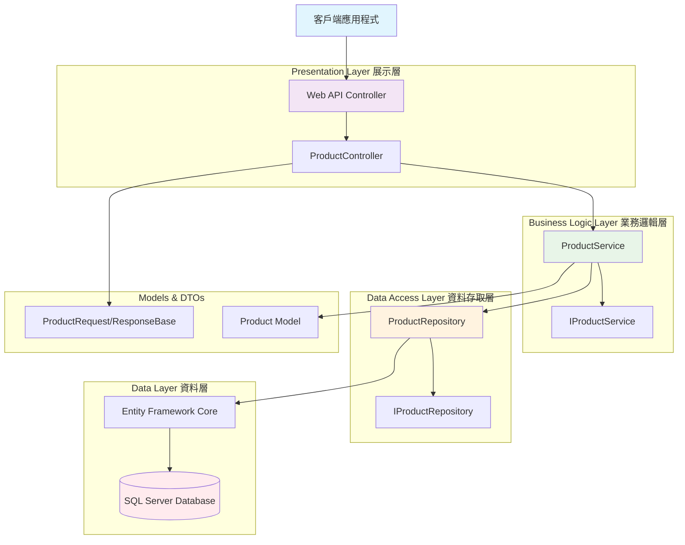
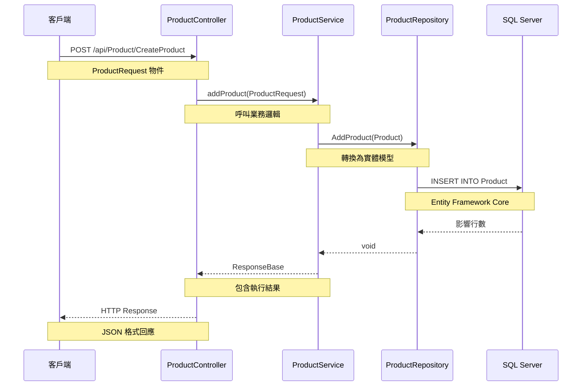
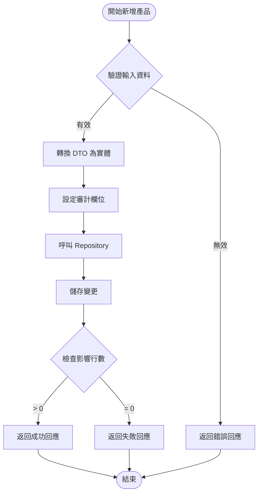
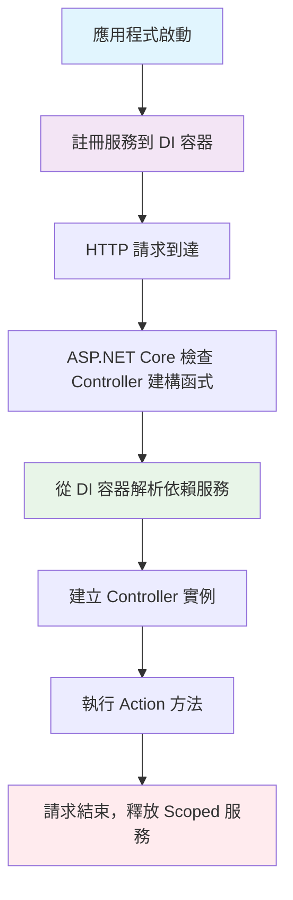

# MyFirstNetApi 教學文件

## 📌 專案概述

`MyFirstNetApi` 是一個使用 .NET 8.0 建立的 Web API 專案，採用分層架構設計，實現了產品管理的基本功能。這個專案展示了現代 .NET Web API 的最佳實踐，包括依賴注入、Entity Framework Core 整合和清潔架構原則。

### 🛠️ 技術堆疊

- **框架**: .NET 8.0 Web API
- **ORM**: Entity Framework Core
- **資料庫**: SQL Server
- **文件生成**: Swagger/OpenAPI
- **依賴注入**: ASP.NET Core 內建 DI 容器
- **設計模式**: Repository Pattern, Service Layer Pattern

### 📁 專案結構

```
MyFirstNetApi/
├── Controllers/          # 控制器層 - 處理 HTTP 請求
│   ├── CustomerController.cs
│   ├── MyFirstApiController.cs
│   └── ProductController.cs
├── Models/              # 資料模型層 - 實體類和 DbContext
│   ├── Customer.cs
│   ├── Product.cs
│   └── TestdbContext.cs
├── Services/            # 業務邏輯層 - 處理商業規則
│   ├── IProductService.cs
│   └── ProductService.cs
├── Repositories/        # 資料存取層 - 處理資料庫操作
│   ├── IProductRepository.cs
│   └── ProductRepository.cs
├── Dto/                 # 資料傳輸物件 - API 輸入輸出格式
│   ├── Request/
│   │   └── ProductRequest.cs
│   └── Response/
│       └── ResponseBase.cs
└── Properties/
    └── launchSettings.json
```

## 🏗️ 系統架構

### 架構圖



### 資料流向圖



## 📋 詳細功能說明

### 1. 控制器層 (Controllers)

#### ProductController.cs
```csharp
[Route("api/[controller]/[action]")]
[ApiController]
public class ProductController : ControllerBase
{
    private readonly IProductServie _IProductServie;
    
    // 依賴注入建構函式
    public ProductController(IProductServie iproductServie)
    {
        _IProductServie = iproductServie;
    }
    
    [HttpPost]
    public IActionResult CreateProduct(ProductRequest request)
    {
        return Ok(_IProductServie.addProduct(request));
    }
}
```

**功能說明:**
- 負責接收 HTTP 請求
- 使用依賴注入獲取服務實例
- 將請求委派給業務邏輯層處理
- 返回 HTTP 回應

### 2. 業務邏輯層 (Services)

#### ProductService.cs
主要功能包括：
- `addProduct()` - 新增產品
- `GetProducts()` - 取得所有產品
- `GetProductsByName()` - 依名稱查詢產品
- `GetProductsByPrice()` - 依價格條件查詢產品

**業務邏輯處理流程:**


### 3. 資料存取層 (Repositories)

#### ProductRepository.cs
```csharp
public class ProductRepository : IProductRepository
{
    private readonly TestdbContext _testdbContext;
    
    // CRUD 操作
    public void AddProduct(Product product) { ... }
    public IQueryable<Product> GetProducts() { ... }
    public void UpdateProduct(Product product) { ... }
    public void DeleteProduct(long productId) { ... }
}
```

### 4. 資料模型 (Models)

#### Product.cs - 產品實體
```csharp
public partial class Product
{
    public long Id { get; set; }           // 主鍵
    public string? Name { get; set; }      // 產品名稱
    public int? Price { get; set; }        // 價格
    public string? Description { get; set; } // 描述
    public string? CustomerId { get; set; } // 客戶ID
    
    // 審計欄位
    public DateTime? CreateDate { get; set; }
    public string? CreateUser { get; set; }
    public DateTime? ModifyDate { get; set; }
    public string? ModifyUser { get; set; }
}
```

## 🚀 快速開始

### 環境需求
- .NET 8.0 SDK
- SQL Server 或 SQL Server Express
- Visual Studio 2022 或 Visual Studio Code

### 安裝步驟

1. **複製專案**
   ```bash
   git clone <repository-url>
   cd MyFirstNetApi
   ```

2. **設定資料庫連線**
   
   修改 `appsettings.json` 或 `TestdbContext.cs` 中的連線字串：
   ```json
   {
     "ConnectionStrings": {
       "Default": "Server=localhost;Database=TESTDB;User ID=sa;Password=Passw0rd;TrustServerCertificate=True;"
     }
   }
   ```

3. **建立資料庫**
   ```bash
   # 使用 Entity Framework Core 建立資料庫
   dotnet ef database update
   ```

4. **執行專案**
   ```bash
   dotnet run
   ```

5. **存取 Swagger UI**
   
   開啟瀏覽器：`https://localhost:7xxx/swagger`

## 📚 API 使用說明

### 產品管理 API

#### 新增產品
```http
POST /api/Product/CreateProduct
Content-Type: application/json

{
  "name": "iPhone 15",
  "description": "最新款 iPhone",
  "price": 35000,
  "customerId": "CUST001"
}
```

**回應範例:**
```json
{
  "result": true,
  "message": "Add product success"
}
```

### 使用 Postman 測試

1. **設定請求**
   - Method: POST
   - URL: `https://localhost:7xxx/api/Product/CreateProduct`
   - Headers: `Content-Type: application/json`

2. **請求 Body**
   ```json
   {
     "name": "測試產品",
     "description": "這是測試產品描述",
     "price": 1000,
     "customerId": "TEST001"
   }
   ```

## 🔧 設計模式說明

### 1. Repository Pattern (儲存庫模式)
- **目的**: 將資料存取邏輯與業務邏輯分離
- **優點**: 
  - 提高可測試性
  - 降低耦合度
  - 便於切換資料存取技術

### 2. Service Layer Pattern (服務層模式)
- **目的**: 封裝業務邏輯和規則
- **優點**:
  - 集中管理業務邏輯
  - 提供清晰的API介面
  - 支援交易管理

### 3. Dependency Injection (依賴注入) - 詳細說明

#### 🎯 什麼是依賴注入？
依賴注入 (DI) 是一種設計模式，用於實現**控制反轉** (Inversion of Control, IoC)。簡單來說，就是讓物件不要自己建立依賴的物件，而是由外部容器來提供。

#### 📝 傳統方式 vs 依賴注入

**❌ 傳統方式 (緊耦合)**
```csharp
public class ProductController : ControllerBase
{
    private readonly ProductService _productService;
    
    public ProductController()
    {
        // 直接在建構函式中建立依賴物件 - 這是不好的做法！
        var dbContext = new TestdbContext();
        var repository = new ProductRepository(dbContext);
        _productService = new ProductService(repository, dbContext);
    }
}
```

**✅ 依賴注入方式 (鬆耦合)**
```csharp
public class ProductController : ControllerBase
{
    private readonly IProductService _productService;
    
    // 透過建構函式接收依賴物件
    public ProductController(IProductService productService)
    {
        _productService = productService;
    }
}
```

#### 🔧 在 Program.cs 中註冊服務

```csharp
var builder = WebApplication.CreateBuilder(args);

// 註冊 DbContext
builder.Services.AddDbContext<TestdbContext>(options =>
    options.UseSqlServer(builder.Configuration.GetConnectionString("Default")));

// 註冊應用程式服務 - 三種生命週期
builder.Services.AddScoped<IProductRepository, ProductRepository>();
builder.Services.AddScoped<IProductService, ProductService>();

// 註冊其他內建服務
builder.Services.AddControllers();
builder.Services.AddSwaggerGen();

var app = builder.Build();
```

#### 📋 服務生命週期類型

| 生命週期 | 方法 | 說明 | 使用時機 |
|---------|------|------|---------|
| **Transient** | `AddTransient<T>()` | 每次請求都建立新實例 | 輕量級、無狀態的服務 |
| **Scoped** | `AddScoped<T>()` | 每個 HTTP 請求建立一個實例 | 資料庫操作、業務邏輯服務 |
| **Singleton** | `AddSingleton<T>()` | 整個應用程式生命週期只建立一個實例 | 設定物件、快取服務 |

#### 💡 生命週期範例

```csharp
// Transient - 每次注入都是新實例
builder.Services.AddTransient<IEmailService, EmailService>();

// Scoped - 同一個 HTTP 請求中共享實例 (推薦用於 Repository 和 Service)
builder.Services.AddScoped<IProductRepository, ProductRepository>();
builder.Services.AddScoped<IProductService, ProductService>();

// Singleton - 整個應用程式共享一個實例
builder.Services.AddSingleton<IConfiguration>(builder.Configuration);
```

#### 🏗️ 依賴注入流程圖



#### 🔍 實際使用範例

**1. 介面定義**
```csharp
public interface IProductService
{
    ResponseBase AddProduct(ProductRequest request);
    List<Product> GetProducts();
}

public interface IProductRepository  
{
    void AddProduct(Product product);
    IQueryable<Product> GetProducts();
}
```

**2. 實作類別**
```csharp
public class ProductService : IProductService
{
    private readonly IProductRepository _repository;
    private readonly TestdbContext _dbContext;
    
    // 建構函式注入 - DI 容器會自動提供這些依賴
    public ProductService(IProductRepository repository, TestdbContext dbContext)
    {
        _repository = repository;
        _dbContext = dbContext;
    }
    
    public ResponseBase AddProduct(ProductRequest request)
    {
        // 使用注入的依賴來執行業務邏輯
        // ...
    }
}
```

**3. 控制器使用**
```csharp
[ApiController]
public class ProductController : ControllerBase
{
    private readonly IProductService _productService;
    
    // ASP.NET Core 會自動從 DI 容器解析 IProductService
    public ProductController(IProductService productService)
    {
        _productService = productService;
    }
    
    [HttpPost]
    public IActionResult CreateProduct(ProductRequest request)
    {
        // 使用注入的服務
        var result = _productService.AddProduct(request);
        return Ok(result);
    }
}
```

#### ✨ 依賴注入的優點

1. **鬆耦合**: 類別不直接依賴具體實作，只依賴介面
2. **可測試性**: 容易進行單元測試，可以注入模擬物件 (Mock)
3. **可維護性**: 修改實作不影響使用者
4. **可擴展性**: 容易加入新的實作或功能

#### 🧪 單元測試範例

```csharp
[Test]
public void AddProduct_Should_Return_Success_When_Valid_Request()
{
    // Arrange - 建立模擬物件
    var mockRepository = new Mock<IProductRepository>();
    var mockDbContext = new Mock<TestdbContext>();
    
    var service = new ProductService(mockRepository.Object, mockDbContext.Object);
    var request = new ProductRequest { Name = "Test Product", Price = 100 };
    
    // Act
    var result = service.AddProduct(request);
    
    // Assert
    Assert.IsTrue(result.Result);
    mockRepository.Verify(r => r.AddProduct(It.IsAny<Product>()), Times.Once);
}
```

#### 🚨 常見錯誤和注意事項

1. **循環依賴**: A 依賴 B，B 又依賴 A
   ```csharp
   // ❌ 避免這種情況
   public class ServiceA 
   {
       public ServiceA(IServiceB serviceB) { }
   }
   
   public class ServiceB 
   {
       public ServiceB(IServiceA serviceA) { }  // 循環依賴！
   }
   ```

2. **忘記註冊服務**
   ```csharp
   // ❌ 如果忘記註冊，會出現運行時錯誤
   // System.InvalidOperationException: Unable to resolve service for type
   
   // ✅ 確保所有依賴都有註冊
   builder.Services.AddScoped<IProductService, ProductService>();
   ```

3. **生命週期不當**
   ```csharp
   // ❌ 不要在 Singleton 中注入 Scoped 服務
   builder.Services.AddSingleton<ISingletonService, SingletonService>();
   builder.Services.AddScoped<IScopedService, ScopedService>();
   
   public class SingletonService 
   {
       // 這會造成問題！Singleton 不應該依賴 Scoped
       public SingletonService(IScopedService scopedService) { }
   }
   ```

#### 🎯 最佳實踐

1. **優先使用建構函式注入**
2. **依賴介面而非具體類別**
3. **選擇適當的服務生命週期**
4. **避免 Service Locator 反模式**
5. **保持依賴圖簡單，避免過深的依賴鏈**

#### 📋 本專案的完整 DI 設定範例

**Program.cs - 完整的 DI 設定**
```csharp
using Microsoft.EntityFrameworkCore;
using MyFirstNetApi.Models;
using MyFirstNetApi.Repositories;
using MyFirstNetApi.Services;

var builder = WebApplication.CreateBuilder(args);

// 1. 註冊 ASP.NET Core 內建服務
builder.Services.AddControllers();
builder.Services.AddEndpointsApiExplorer();
builder.Services.AddSwaggerGen();

// 2. 註冊 Entity Framework DbContext
builder.Services.AddDbContext<TestdbContext>(options =>
    options.UseSqlServer(builder.Configuration.GetConnectionString("Default")));

// 3. 註冊應用程式服務 (使用 Scoped 生命週期)
builder.Services.AddScoped<IProductRepository, ProductRepository>();
builder.Services.AddScoped<IProductService, ProductService>();

// 4. 註冊其他自訂服務 (如果需要)
// builder.Services.AddScoped<ICustomerService, CustomerService>();
// builder.Services.AddTransient<IEmailService, EmailService>();
// builder.Services.AddSingleton<ICacheService, RedisCacheService>();

var app = builder.Build();

// 設定 HTTP 請求管道
if (app.Environment.IsDevelopment())
{
    app.UseSwagger();
    app.UseSwaggerUI();
}

app.UseHttpsRedirection();
app.UseAuthorization();
app.MapControllers();

app.Run();
```

#### 🔄 DI 在控制器中的完整使用流程

```csharp
// 1. 定義介面契約
public interface IProductService
{
    ResponseBase AddProduct(ProductRequest request);
    List<Product> GetProducts();
    List<Product> GetProductsByName(string name);
}

// 2. 實作服務類別
public class ProductService : IProductService
{
    private readonly IProductRepository _productRepository;
    private readonly TestdbContext _dbContext;
    private readonly ILogger<ProductService> _logger; // 可選：加入日誌記錄
    
    // 建構函式注入所有依賴
    public ProductService(
        IProductRepository productRepository, 
        TestdbContext dbContext,
        ILogger<ProductService> logger)
    {
        _productRepository = productRepository;
        _dbContext = dbContext;
        _logger = logger;
    }
    
    public ResponseBase AddProduct(ProductRequest request)
    {
        _logger.LogInformation("開始新增產品: {ProductName}", request.Name);
        
        try
        {
            var product = new Product
            {
                Name = request.Name,
                Description = request.Description,
                Price = request.Price.Value,
                CustomerId = request.CustomerId,
                CreateDate = DateTime.Now,
                CreateUser = "system"
            };
            
            _productRepository.AddProduct(product);
            var count = _dbContext.SaveChanges();
            
            if (count > 0)
            {
                _logger.LogInformation("產品新增成功: {ProductName}", request.Name);
                return new ResponseBase { Result = true, Message = "新增產品成功" };
            }
            else
            {
                _logger.LogWarning("產品新增失敗: 資料庫未異動");
                return new ResponseBase { Result = false, Message = "新增產品失敗" };
            }
        }
        catch (Exception ex)
        {
            _logger.LogError(ex, "新增產品時發生錯誤: {ProductName}", request.Name);
            return new ResponseBase { Result = false, Message = ex.Message };
        }
    }
}

// 3. 控制器使用注入的服務
[Route("api/[controller]/[action]")]
[ApiController]
public class ProductController : ControllerBase
{
    private readonly IProductService _productService;
    private readonly ILogger<ProductController> _logger;
    
    // ASP.NET Core 自動解析並注入依賴
    public ProductController(IProductService productService, ILogger<ProductController> logger)
    {
        _productService = productService;
        _logger = logger;
    }
    
    [HttpPost]
    public IActionResult CreateProduct(ProductRequest request)
    {
        _logger.LogInformation("收到新增產品請求");
        
        if (!ModelState.IsValid)
        {
            return BadRequest(ModelState);
        }
        
        var result = _productService.AddProduct(request);
        
        if (result.Result)
        {
            return Ok(result);
        }
        else
        {
            return StatusCode(500, result);
        }
    }
}
```

#### 🧪 如何為使用 DI 的程式碼寫單元測試

```csharp
using Microsoft.Extensions.Logging;
using Moq;
using NUnit.Framework;

[TestFixture]
public class ProductServiceTests
{
    private ProductService _productService;
    private Mock<IProductRepository> _mockRepository;
    private Mock<TestdbContext> _mockDbContext;
    private Mock<ILogger<ProductService>> _mockLogger;
    
    [SetUp]
    public void Setup()
    {
        _mockRepository = new Mock<IProductRepository>();
        _mockDbContext = new Mock<TestdbContext>();
        _mockLogger = new Mock<ILogger<ProductService>>();
        
        // 使用模擬物件建立服務實例
        _productService = new ProductService(
            _mockRepository.Object, 
            _mockDbContext.Object,
            _mockLogger.Object);
    }
    
    [Test]
    public void AddProduct_ValidRequest_ReturnsSuccess()
    {
        // Arrange
        var request = new ProductRequest 
        { 
            Name = "Test Product", 
            Price = 100, 
            Description = "Test Description",
            CustomerId = "CUST001"
        };
        
        _mockDbContext.Setup(x => x.SaveChanges()).Returns(1); // 模擬成功儲存
        
        // Act
        var result = _productService.AddProduct(request);
        
        // Assert
        Assert.IsTrue(result.Result);
        Assert.AreEqual("新增產品成功", result.Message);
        
        // 驗證方法有被呼叫
        _mockRepository.Verify(r => r.AddProduct(It.IsAny<Product>()), Times.Once);
        _mockDbContext.Verify(db => db.SaveChanges(), Times.Once);
    }
    
    [Test]
    public void AddProduct_DatabaseError_ReturnsFailure()
    {
        // Arrange
        var request = new ProductRequest { Name = "Test Product", Price = 100 };
        _mockDbContext.Setup(x => x.SaveChanges()).Returns(0); // 模擬儲存失敗
        
        // Act
        var result = _productService.AddProduct(request);
        
        // Assert
        Assert.IsFalse(result.Result);
        Assert.AreEqual("新增產品失敗", result.Message);
    }
}
```

## 📊 資料庫結構

### Product 資料表
| 欄位名 | 資料型別 | 說明 |
|--------|----------|------|
| Id | bigint | 主鍵，自動遞增 |
| Name | nvarchar(50) | 產品名稱 |
| Price | int | 價格 |
| Description | nvarchar(200) | 產品描述 |
| CustomerId | varchar(50) | 客戶編號 |
| CreateDate | datetime | 建立日期 |
| CreateUser | nvarchar(50) | 建立者 |
| ModifyDate | datetime | 修改日期 |
| ModifyUser | nvarchar(50) | 修改者 |

### Customer 資料表
| 欄位名 | 資料型別 | 說明 |
|--------|----------|------|
| Id | bigint | 主鍵，自動遞增 |
| CustomerId | varchar(50) | 客戶編號 |
| Name | varchar(200) | 客戶名稱 |
| Mail | varchar(200) | 電子郵件 |
| Address | varchar(200) | 地址 |
| CreateDate | datetime | 建立日期 |
| CreateUser | varchar(50) | 建立者 |
| ModifyDate | datetime | 修改日期 |
| ModifyUser | varchar(50) | 修改者 |

## 🎯 學習重點

### 1. .NET Web API 基礎
- 控制器建立和路由設定
- HTTP 動詞使用 (GET, POST, PUT, DELETE)
- 模型綁定和驗證

### 2. Entity Framework Core
- Code First 開發方式
- DbContext 設定和使用
- LINQ 查詢語法

### 3. 依賴注入
- 服務註冊 (Scoped, Transient, Singleton)
- 介面設計原則
- 建構函式注入

### 4. 分層架構
- 關注點分離 (Separation of Concerns)
- 單一職責原則 (Single Responsibility Principle)
- 開放封閉原則 (Open-Closed Principle)

## 🚨 注意事項

1. **安全性**
   - 目前資料庫連線字串寫在程式碼中，生產環境應移至設定檔
   - 缺少輸入驗證和錯誤處理
   - 沒有實作身份驗證和授權

2. **效能**
   - 查詢方法返回 `IQueryable`，需要注意延遲載入
   - 大量資料查詢時考慮分頁

3. **程式碼品質**
   - 部分介面命名不一致 (IProductServie 應為 IProductService)
   - 可考慮加入更多的錯誤處理機制

## 📖 延伸學習建議

1. **加入更多功能**
   - 實作完整的 CRUD 操作
   - 加入分頁和排序功能
   - 實作搜尋和篩選

2. **提升安全性**
   - 加入 JWT 身份驗證
   - 實作角色權限控制
   - 輸入驗證和 SQL 注入防護

3. **測試**
   - 單元測試 (Unit Test)
   - 整合測試 (Integration Test)
   - API 測試自動化

4. **進階主題**
   - 快取策略 (Redis)
   - 訊息佇列 (RabbitMQ)
   - 微服務架構

---

這個專案提供了學習 .NET Web API 開發的良好起點，透過實際操作可以更深入理解現代 Web API 的設計原則和最佳實踐。